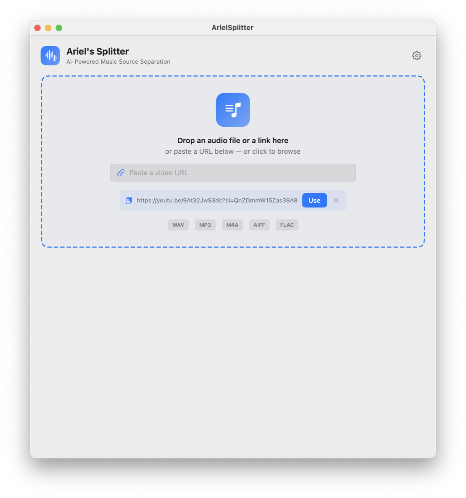
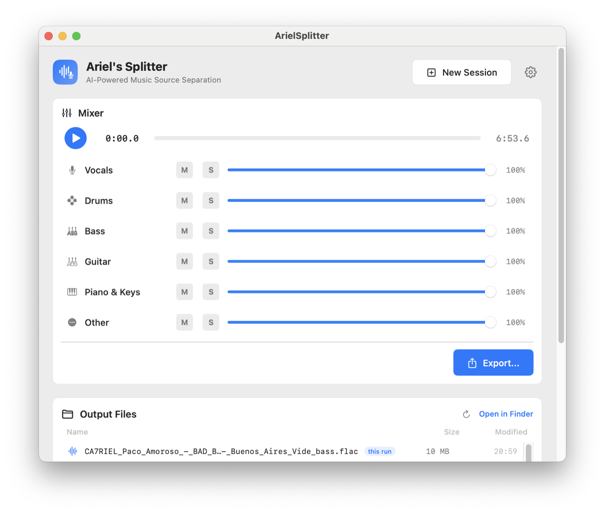
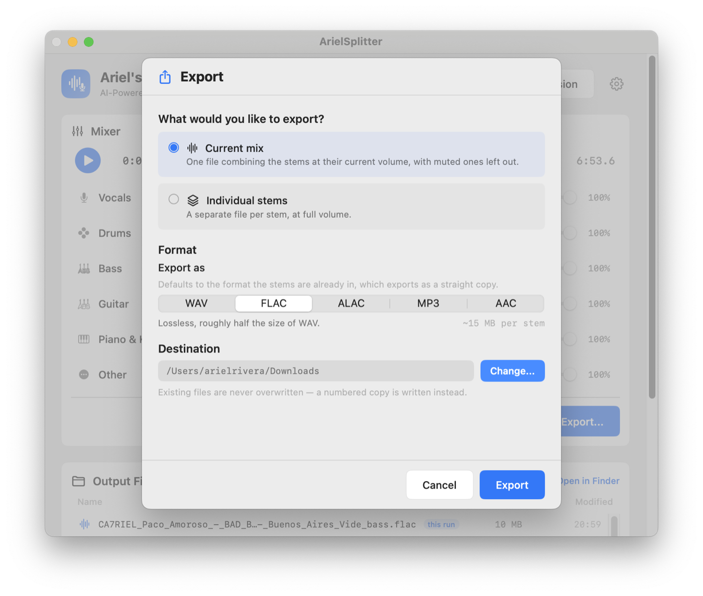
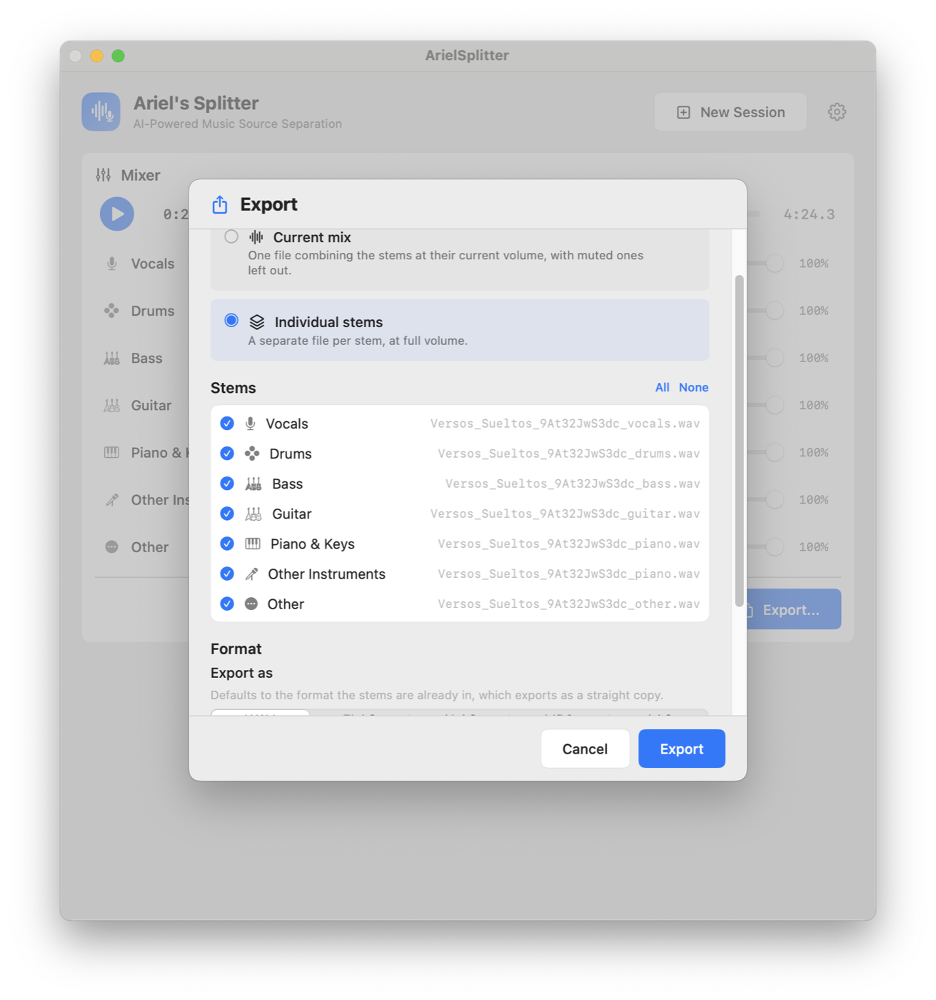
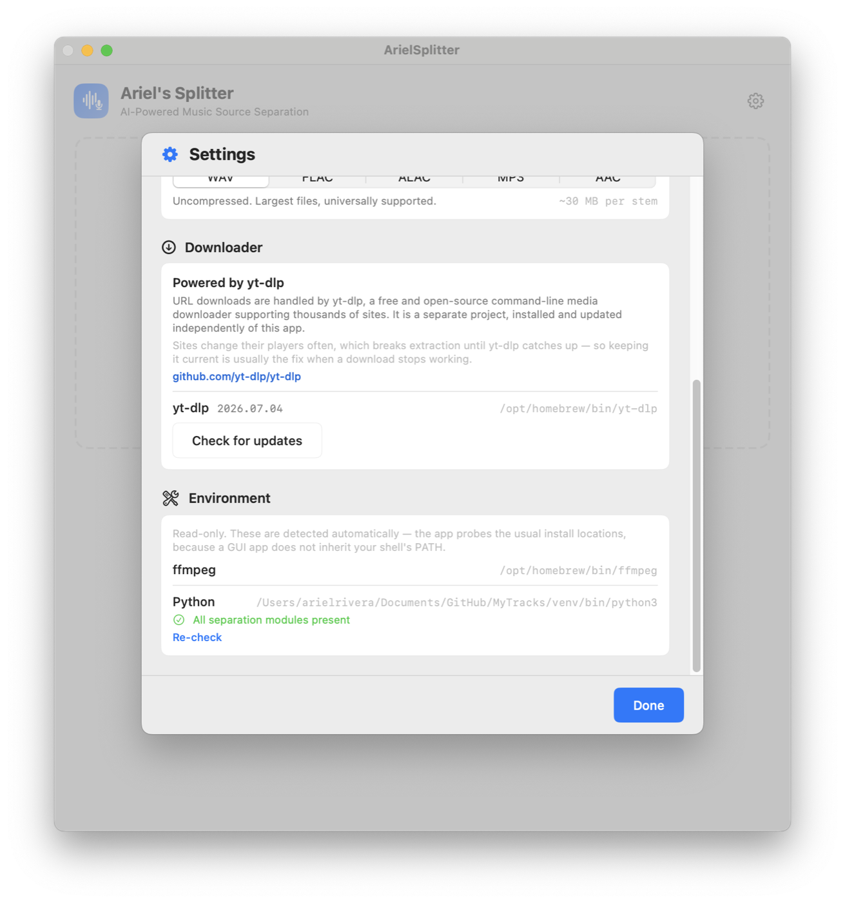

# ArielSplitter

A native macOS application for AI-powered musical source separation. Split a song into independent stems (vocals, drums, bass, guitar, piano, other) using the open-source [Demucs](https://github.com/facebookresearch/demucs) model, all processed locally on your Mac.

## Features

- One drop zone for everything: drop a file, drop a link, paste a URL, or click to browse.
- Download audio, video, or both from a URL with `yt-dlp` — the audio loads for separation automatically.
- Choose which stems to extract.
- Real-time progress with status messages; the window shows only what applies to the current stage.
- Built-in mixer to solo, mute, and set levels after separation.
- Export the current mix or individual stems, without overwriting earlier exports.
- Write stems and exports as WAV, FLAC, ALAC, MP3, or AAC — separation always runs at full quality.
- Output files are named after the source track, so separate runs don't overwrite each other.
- Consolidated settings (`⌘,`), including yt-dlp updates and environment diagnostics.
- Native SwiftUI interface, no Electron or web wrapper.

## Interface

**Getting audio in** — one drop zone handles a dropped file, a dropped link, a
pasted URL, or a click to browse. A link on the clipboard is offered as a
suggestion you can accept or dismiss.



**Mixer** — after separation the window becomes the mixer: solo, mute, and set
levels per stem, then export.



**Export** — one dialog covers the whole job: the current mix or individual
stems, the output format, and where it goes.





**Settings** — locations, audio format, yt-dlp status and updates, and read-only
environment diagnostics.



## Requirements

- Apple Silicon Mac (M1 or newer)
- macOS 14 (Sonoma) or later
- About 4 GB of free disk space for the first install (PyTorch is large)
- **Command Line Tools** — full Xcode is *not* required
- An internet connection for the first setup, and again the first time Demucs
  downloads a model (after that, processing is fully local)

`./setup.sh --install-tools` will install everything else: a real Python 3.10+,
ffmpeg, yt-dlp, and Homebrew if this Mac does not already have them.

Apple's `/usr/bin/python3` is 3.9 and **cannot** run this app. Do not use it.

> **Why ffmpeg is required:** `librosa` 1.0 dropped its `audioread` fallback, so it
> can only open formats libsndfile understands — WAV, MP3, FLAC, OGG, AIFF. Anything
> else, including the `.m4a`/`.mp4` files that URL downloads produce, is transcoded
> with ffmpeg first. Without it those files fail to load.

## Quick start

On a new Mac, this is the whole install:

```bash
xcode-select --install          # once, if you have never installed the Command Line Tools
git clone <this repo>
cd MyTracks
./setup.sh --install-tools
./run.sh
```

`--install-tools` is the flag to use on a machine that is not already a
development Mac. It will:

1. Confirm this is Apple Silicon running macOS 14+
2. Open the Command Line Tools installer if `swift` is missing
3. Install Homebrew if needed (may ask for your password)
4. Install Python 3.12 if the Mac only has Apple's 3.9
5. Create `venv/` and install `requirements.txt` (PyTorch, Demucs, yt-dlp, …)
6. Install ffmpeg
7. Build the app and write `ArielSplitter.app` in this folder

Without the flag, `./setup.sh` still does the Python and Swift work, and
*asks* before installing missing tools when you run it in a terminal.

Then launch with `./run.sh`, or double-click `ArielSplitter.app`.

```bash
./setup.sh --recreate        # rebuild the virtualenv from scratch
./setup.sh --release         # build the optimized binary
./setup.sh --install-tools   # non-interactive: install anything missing
```

`./run.sh` will run setup itself if the checkout is not ready yet.

### Manual setup

If you would rather not use the script:

```bash
# A Homebrew Python, not /usr/bin/python3
brew install python@3.12 ffmpeg
python3.12 -m venv venv
./venv/bin/python3 -m pip install -r requirements.txt
cd "Ariel's Splitter" && swift build
```

Then `./run.sh` from the repository root. yt-dlp is in `requirements.txt`, so
URL downloads work without a separate `brew install yt-dlp`.

> **Use a virtualenv at the repository root.** The app searches for `venv/`,
> `.venv/` or `env/` near the project and rejects any interpreter missing a
> required module. A global `pip install` is not reliably picked up, because a
> GUI-launched app does not inherit your shell's `PATH`.

## Troubleshooting

| What you see | What to do |
| --- | --- |
| `swift not found` / a dialog about Command Line Tools | Run `xcode-select --install`, wait for it to finish, then re-run `./setup.sh` |
| `no Python 3.10+ found` | Apple's system Python is 3.9. Run `./setup.sh --install-tools` or `brew install python@3.12` |
| `pip install failed` | Need a network connection. If this Python is newer than 3.14, install 3.12 and pass `--recreate` |
| `ffmpeg not found` (setup or in the app) | `./setup.sh --install-tools`, or `brew install ffmpeg` |
| The app opens but says it is not set up | The GUI cannot see your shell `PATH`. Run `./setup.sh` so the project `venv/` exists next to this README |
| Intel Mac / "running under Rosetta" | Apple Silicon only. Uncheck "Open using Rosetta" on Terminal if this is an Apple Silicon Mac |
| First separation is slow / downloads something | Normal. Demucs fetches its model into `~/.cache/huggingface` once |

The in-app **Settings → Environment** panel shows the same Python and ffmpeg
detection the engine uses.

## Project structure

```text
MyTracks/
├── setup.sh                    # One-command environment setup
├── run.sh                      # Launch the app (runs setup if needed)
├── ArielSplitter.app           # Created by setup.sh; double-click to open
├── requirements.txt            # Python dependencies
├── README.md
├── README_Detailed.md
├── prompts/                    # Original AI prompts (optional)
├── venv/                       # Created by setup.sh (git-ignored)
└── Ariel's Splitter/
    ├── Package.swift
    └── Sources/
        └── ArielSplitter/
            ├── App/            # App entry point and design system
            ├── Audio/          # AVAudioEngine playback
            ├── Download/       # yt-dlp integration and tool discovery
            ├── Models/         # Data models, URL validation
            ├── Resources/      # separate.py (Demucs wrapper)
            ├── Separation/     # SeparationEngine, PythonLocator
            ├── ViewModels/     # AppViewModel
            └── Views/          # SwiftUI views, Settings and Export dialogs
```

## AI prompts

The original AI prompts used to generate this app from scratch are included in the `prompts/` folder, in both Spanish and English, for macOS and Windows. They are completely optional — the app is already built and ready to use.

## License

See the `prompts/` folder for licensing notes on third-party models and dependencies.
